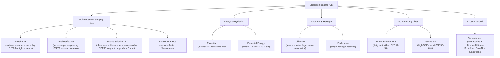

# Shiseido US Skincare — Family Tree & Data Sheet

**Source:** shiseido.com/us/en (skincare + suncare + men's sections)
**Scope:** Skincare only (makeup, fragrance, and gift-only pages excluded per request)
**Date crawled:** 2026-07-16
**Companion files:**
- [`shiseido-skincare-family-tree.csv`](./shiseido-skincare-family-tree.csv) — full flat data sheet, one row per size/refill variant (125 rows), now includes a **Primary Image** column with a local file path for each row
- [`shiseido-product-images-manifest.csv`](./shiseido-product-images-manifest.csv) — every downloaded image (295 total, all PDP gallery images per product, not just the hero shot), mapped to Collection, Product Name, Product ID, local path, source URL, and PDP URL
- [`images/`](./images/) — the actual downloaded image files, one subfolder per collection (Benefiance, Vital-Perfection, Bio-Performance, Future-Solution-LX, Essentials, Essential-Energy, Ultimune, Eudermine, Urban-Environment, Ultimate-Sun, Shiseido-Men), ~14MB total

**Image coverage:** 86 unique products/sets → 295 images (full PDP gallery, not just 1 hero shot per product — e.g. Benefiance has 44 images across 10 products, Vital Perfection has 50 images across 11 products). Filenames follow `<product-name-slug>-<product-id>_<image-index>.<ext>`.

Site-wide filter vocabulary (as exposed by Shiseido's own category filters, used for the "Skin Type Fit" and "Concern" columns in the CSV):
- **Skin Type filter options:** Combination, Dry, Oily *(the site does not expose "Normal" or "Sensitive" as filter chips — those only appear in some product copy, e.g. "Normal & Dry")*
- **Concern filter options:** Brightening, Wrinkle Smoothing, Anti-Aging, Lifting & Firming, Deeply Hydrating, Pore Minimizing, Texture & Tone Refining
- **Product-type categories:** Cleansers & Makeup Removers, Softeners, Serums & Treatments, Moisturizers & Creams, Eye & Lip Care, Masks, Sunscreen, Refillable Skincare

---

## 1. Family tree — grouped by routine completeness

Collections that form (or nearly form) a full cleanser→toner→serum→moisturizer→SPF routine are grouped together, boosters/heritage single-products next, then suncare-only lines, then the Men's cross-branded line last.



**Reading it:** Benefiance, Vital Perfection, Future Solution LX, and Bio-Performance are the four lines where you can buy nearly every step of a routine under one collection name — they're clustered first. Essentials/Essential Energy cover the simple/entry side of a routine. Ultimune and Eudermine are single-product boosters that get bundled *into* other collections' routines (see cross-collection bundles below). Urban Environment and Ultimate Sun are sunscreen-only. Shiseido Men has its own core routine but fills out sun protection by re-badging products from three other collections.

---

## 2. Collection → Sub-product → Variant outline

### 2.1 Benefiance — Full routine (anti-aging / wrinkle smoothing)
Covers: Softener → Serum → Eye Cream/Mask → Day Cream (SPF 23) → Night Cream → Moisturizer

| Sub-Product | Type | Variants | Price | Skin Type | Notes |
|---|---|---|---|---|---|
| Treatment Softener | Softener | 150mL, 300mL | $55.00 | Normal/Oily | Best Seller |
| Treatment Softener Enriched | Softener | 150mL, 300mL | $55.00 | Normal/Dry | Best Seller |
| Dark Spot and Wrinkle Smoothing Serum | Serum | 30mL, 50mL | $89.00 | Combo/Dry/Oily | Best Seller; Brightening |
| Wrinkle Smoothing Eye Cream | Eye Cream | Standard | $67.00 | Combo/Dry/Oily | Best Seller, Award Winner |
| WrinkleResist24 Retinol Eye Mask | Eye Mask | Standard | $75.00 | Combo/Dry/Oily | Retinol |
| Wrinkle Smoothing Day Cream SPF 23 | Moisturizer+SPF | Standard | $78.00 | Combo/Dry/Oily | Best Seller |
| Overnight Wrinkle Resisting Cream | Night Cream | Standard | $103.00 | Combo/Dry/Oily | Best Seller |
| Wrinkle Smoothing Cream | Moisturizer | 50mL, 75mL | $78.00 | Combo/Dry/Oily | Best Seller |
| Wrinkle Smoothing Cream Enriched | Moisturizer | 50mL | $78.00 | Dry | Richer formula |
| Brightening and Wrinkle Smoothing Cream | Moisturizer | 50mL, 50mL Refill | $95.00 | Combo/Dry/Oily | Best Seller |
| Smooth & Strengthen Set | Set | Set | $78.00 ($147 val) | Combo/Dry/Oily | Bundle |

### 2.2 Vital Perfection — Full routine (lifting & firming)
Covers: Serum → Night Concentrate → Spot Treatment → Eye Cream/Mask → Day Cream (SPF 30) → Cream → Face Mask

| Sub-Product | Type | Variants | Price | Skin Type | Notes |
|---|---|---|---|---|---|
| LiftDefine Radiance Serum | Serum | 40mL, 80mL | $152.00 | Combo/Dry/Oily | Out of stock |
| LiftDefine Radiance Night Concentrate | Serum (night) | Standard | $152.00 | Combo/Dry/Oily | Out of stock |
| Intensive WrinkleSpot Treatment A+ | Spot Treatment | Standard | $105.00 | Combo/Dry/Oily | — |
| Uplifting and Firming Advanced Eye Cream | Eye Cream | Standard | $95.00 | Combo/Dry/Oily | — |
| Uplifting and Firming Express Eye Mask | Eye Mask | Standard | $95.00 | Combo/Dry/Oily | Retinol |
| LiftDefine Radiance Face Mask | Face Mask | Standard | $115.00 | Combo/Dry/Oily | Face & neck |
| Uplifting and Firming Advanced Day Cream SPF 30 | Moisturizer+SPF | 50mL, 50mL Refill | $146.00 | Combo/Dry/Oily | Best Seller |
| Uplifting & Firming Advanced Cream | Moisturizer | 50mL, 50mL Refill | $146.00 | Combo/Dry/Oily | — |
| Concentrated Supreme Cream | Moisturizer | 50mL, 50mL Refill | $165.00 | Combo/Dry/Oily | Top cream in line |
| Lifting & Firming Eye Care Set | Set | Set | $95.00 ($159 val) | Combo/Dry/Oily | Bundle |
| Firm & Sculpt Set | Set | Set | $146.00 | Combo/Dry/Oily | Bundle |

### 2.3 Future Solution LX — Full luxury routine + Legendary Enmei capsule
Covers: Cleanser → Softener → Serum → Eye/Lip Cream → Day Cream (SPF 30) → Night Cream, plus ultra-luxury **Legendary Enmei** sub-line and makeup/suncare crossovers

| Sub-Product | Type | Variants | Price | Skin Type | Notes |
|---|---|---|---|---|---|
| Extra Rich Cleansing Foam | Cleanser | Standard | $79.00 | Dry | — |
| Concentrated Brightening Softener | Softener | 170mL, Refill | $129.00 | Combo/Dry/Oily | Brightening |
| Intensive Firming Brilliance Serum | Serum | 50mL, Refill | $335.00 | Combo/Dry/Oily | — |
| Eye and Lip Contour Regenerating Cream | Eye/Lip Cream | 17mL, Refill | $175.00 | Combo/Dry/Oily | — |
| Total Protective Cream SPF 30 | Moisturizer+SPF | 50mL, Refill | $305.00 | Combo/Dry/Oily | Best Seller |
| Total Regenerating Cream | Night Cream | 50mL, Refill | $305.00 | Combo/Dry/Oily | — |
| Universal Defense SPF 50 | Sunscreen | Standard | $120.00 | Combo/Dry/Oily | Also in Men's line |
| Infinite Treatment Primer SPF 30 | Primer+SPF | Standard | $78.00 | Combo/Dry/Oily | Out of stock; makeup |
| Total Radiance Loose Powder | Powder | Standard | $97.00 | Combo/Dry/Oily | Makeup |
| **Legendary Enmei Ultimate Renewing Cream** | Moisturizer | Standard | $580.00 | Combo/Dry/Oily | Top of range |
| **Legendary Enmei Ultimate Luminance Serum** | Serum | Standard | $480.00 | Combo/Dry/Oily | Top of range |
| **Legendary Enmei Ultimate Brilliance Eye Cream** | Eye Cream | Standard | $355.00 | Combo/Dry/Oily | Top of range |

### 2.4 Bio-Performance — Partial routine (advanced anti-aging: serum + cream)

| Sub-Product | Type | Variants | Price | Skin Type | Notes |
|---|---|---|---|---|---|
| Micro-Click Concentrate | Serum | Standard | $290.00 | Combo/Dry/Oily | Next-gen |
| Skin Filler Serums | Serum (2-step) | 30mL x2, Refill | $308.00 | Combo/Dry/Oily | 2-step system |
| Advanced Super Revitalizing Cream | Moisturizer | 50mL, 75mL | $110–$140 | Combo/Dry/Oily | Best Seller |
| Advanced Super Revitalizing Cream Duo | Moisturizer (bundle) | Duo | $224.00 (20% off) | Combo/Dry/Oily | Bundle |

### 2.5 Essentials — Everyday cleansers (no anti-aging branding)

| Sub-Product | Type | Variants | Price | Skin Type | Notes |
|---|---|---|---|---|---|
| Clarifying Cleansing Foam | Cleanser (foam) | Standard | $39.00 | Combo/Dry/Oily | Best Seller |
| Perfect Cleansing Oil | Cleanser (oil) | 180mL, 300mL | $39–$55 | Combo/Dry/Oily | — |
| Deep Cleansing Foam | Cleanser (foam) | Standard | $39.00 | Oily | Pore minimizing |
| Complete Cleansing Microfoam | Cleanser (foam) | Standard | $39.00 | Combo/Oily | — |
| Instant Eye and Lip Makeup Remover | Remover | Standard | $36.00 | All | Best Seller |
| Refreshing Cleansing Water | Cleanser (water) | Standard | $36.00 | Combo/Dry/Oily | — |
| Extra Rich Cleansing Milk | Cleanser (milk) | Standard | $39.00 | Dry | Out of stock |
| Cleansing Massage Brush | Tool | Standard | $30.00 | All | Tool, not formula |

### 2.6 Essential Energy — Partial routine (entry-level hydration)

| Sub-Product | Type | Variants | Price | Skin Type | Notes |
|---|---|---|---|---|---|
| Hydrating Cream | Moisturizer | 50mL, 50mL Refill | $46–$54 | Combo/Dry/Oily | Deeply Hydrating |
| Hydrating Day Cream Broad Spectrum SPF 20 | Moisturizer+SPF | Standard | $54.00 | Combo/Dry/Oily | — |
| Nourish & Hydrate Set | Set | Set | $54.00 ($85 val) | Combo/Dry/Oily | Bundle |

### 2.7 Ultimune — Booster serum family (layers onto any routine)

| Sub-Product | Type | Variants | Price | Skin Type | Notes |
|---|---|---|---|---|---|
| Power Infusing Serum | Serum | 30/50/75/120mL, 75mL Refill | $160.00 | Combo/Dry/Oily | Best Seller |
| Power Infusing Oil | Facial oil | Standard | $75.00 | Combo/Dry/Oily | Limited Edition |
| Future Power Shot | Concentrate | Standard | $75.00 | Combo/Dry/Oily | Last Chance |
| Correct & Prevent Set | Set | Set | $160.00 ($266 val) | Combo/Dry/Oily | Bundle |
| Serum & Eudermine Bundle | Cross-collection bundle | Standard | $183.60 (15% off) | Combo/Dry/Oily | + Eudermine |
| Serum & Refill Bundle | Bundle | Standard | $251.60 (15% off) | Combo/Dry/Oily | — |
| Serum & Benefiance Eye Cream Bundle | Cross-collection bundle | Standard | $158.95 (15% off) | Combo/Dry/Oily | + Benefiance |

### 2.8 Eudermine — Single heritage product

| Sub-Product | Type | Variants | Price | Skin Type | Notes |
|---|---|---|---|---|---|
| Activating Essence | Essence/Softener | 145mL, 145mL Refill | $96.00 | All | Best Seller; 1897 heritage formula; 2x HA + Vit C + Kefir + Yuzu |

### 2.9 Urban Environment — Suncare-only (daily antioxidant)

| Sub-Product | Type | Variants | Price | SPF | Skin Type |
|---|---|---|---|---|---|
| Oil-Control Sunscreen | Sunscreen (lotion) | 30/50/143mL | $52.00 | 40 | Oily/Combo — Best Seller |
| Vita-Clear Sunscreen | Sunscreen | Standard | $39.00 | 42 | Combo/Dry/Oily |
| Fresh-Moisture Sunscreen | Sunscreen (cream) | Standard | $39.00 | 40 | Dry |
| Mineral Clear Sunscreen | Sunscreen (mineral) | 30/50mL | $39.00 | 50 | Combo/Dry/Oily — New size |
| Daily Suncare Set | Set | Set | $53.00 ($78 val) | — | Combo/Dry/Oily |

### 2.10 Ultimate Sun — Suncare-only (high SPF / sport)

| Sub-Product | Type | Variants | Price | SPF | Skin Type |
|---|---|---|---|---|---|
| Protector Clear Stick | Sunscreen (stick) | 20g, 60g | $33.00 | 60+ | Combo/Dry/Oily — Best Seller |
| Protector Cream | Sunscreen (cream) | Standard | $44.00 | 50 | Combo/Dry/Oily |
| Protector Lotion Mineral | Sunscreen (mineral) | 50/150mL | $52.00 | 60+ | Combo/Dry/Oily — Face & Body |
| Protector Lotion | Sunscreen (lotion) | 50/150/300mL | $52.00 | 60+ | Combo/Dry/Oily |
| Active Sun Protection Set | Set | Set | $52.00 ($83 val) | — | Combo/Dry/Oily |

### 2.11 Shiseido Men — Own routine + cross-branded sunscreens

| Sub-Product | Type | Variants | Price | Skin Type | Notes |
|---|---|---|---|---|---|
| Face Cleanser | Cleanser | Standard | $33.00 | Combo/Dry/Oily | Also shaving cream |
| Hydrating Lotion | Softener | Standard | $38.00 | Combo/Dry/Oily | — |
| Energizing Moisturizer Extra Light Fluid | Moisturizer | Standard | $48.00 | Combo/Oily | — |
| Total Revitalizer Eye Cream | Eye Cream | Standard | $54.00 | Combo/Dry/Oily | — |
| Total Revitalizer Cream | Moisturizer | Standard | $81.00 | Combo/Dry/Oily | — |
| Ultimune Power Infusing Serum (Men's) | Serum | Standard | $120.00 | Combo/Dry/Oily | Cross-branded |
| Ultimate Sun Protector Cream SPF 50 | Sunscreen | Standard | $44.00 | Combo/Dry/Oily | Cross-branded |
| Future Solution LX Universal Defense SPF 50 | Sunscreen | Standard | $120.00 | Combo/Dry/Oily | Cross-branded |
| Ultimate Sun Protector Clear Stick SPF 60+ | Sunscreen (stick) | 20g, 60g | $33.00 | Combo/Dry/Oily | Cross-branded |
| Urban Environment Mineral Clear SPF 50 | Sunscreen | 30/50mL | $39.00 | Combo/Dry/Oily | Cross-branded |
| Urban Environment Oil-Control SPF 40 | Sunscreen | 30/50/143mL | $52.00 | Combo/Oily | Cross-branded |
| Cleanse & Moisturize Set | Set | Set | $90.00 ($132 val) | Combo/Dry/Oily | Bundle |
| Strengthening / Basics / Hydrating / Eye Care Bundles | Bundles | Standard | $73–$171 | Combo/Dry/Oily | 4 bundles |

---

## 3. Product images

Every product page's full image gallery was downloaded — not just the collection-listing thumbnail. Example (Benefiance Wrinkle Smoothing Eye Cream, 8 images captured from its PDP):

```
images/benefiance/
├── wrinkle-smoothing-eye-cream-0768614208570_1.jpg   (hero shot)
├── wrinkle-smoothing-eye-cream-0768614208570_2.jpg   (texture/swatch)
├── wrinkle-smoothing-eye-cream-0768614208570_3.jpg   (packaging detail)
├── wrinkle-smoothing-eye-cream-0768614208570_4.jpg
├── wrinkle-smoothing-eye-cream-0768614208570_5.jpg   (ingredient callout)
├── wrinkle-smoothing-eye-cream-0768614208570_6.jpg
├── wrinkle-smoothing-eye-cream-0768614208570_7.jpg
└── wrinkle-smoothing-eye-cream-0768614208570_8.jpg
```

The `Primary Image` column in the main CSV always points at image `_1` (the hero shot) for quick reference; `shiseido-product-images-manifest.csv` lists every image in every product's gallery if you need the full set (e.g. for a catalog mockup or slide deck).

---

## 4. Caveats

- Single-pass crawl on 2026-07-16 — Shiseido rotates limited editions and bundle contents frequently, so set/bundle SKUs, and their associated images, are the most likely to have changed if you revisit.
- "Skin Type Fit" values are capped at what the site's own filter exposes (Combination/Dry/Oily). Where product copy calls out "Normal" (e.g. Benefiance softeners), that's noted in the Notes column rather than invented as a filter value. No product on-site is filterable by "Sensitive."
- Scope is skincare + suncare + men's skincare only — makeup (foundation, lip, eye), fragrance, and pure gift-set pages were excluded per your answer to keep the skin-type/product-type schema meaningful. One makeup item (UV Protective Stick Foundation SPF 37) that surfaced incidentally in a listing page was dropped from both CSVs to keep scope clean.
- Prices are list prices seen at crawl time; several products showed active discounts (e.g. 15–20% off bundles) which are noted in the Price column rather than normalized away.
- Images were sourced directly from Shiseido's CDN (`shiseido.com/dw/image/...`) at 650×650px resolution — the size the site itself serves for PDP galleries. Downloaded for personal/research reference; check Shiseido's terms before any redistribution or commercial use.
